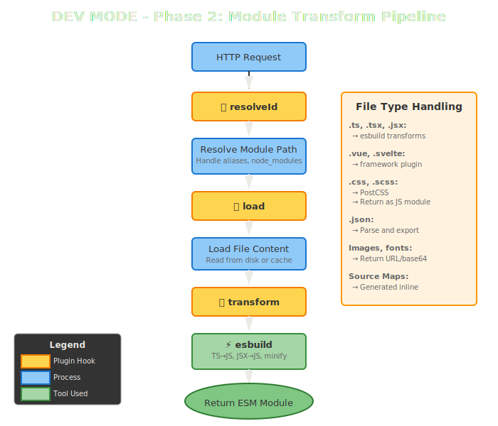
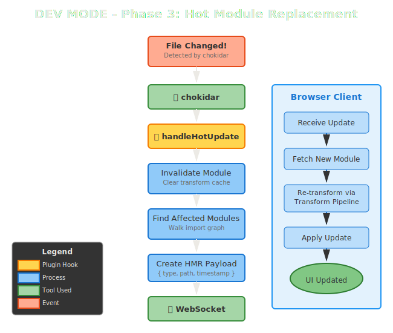
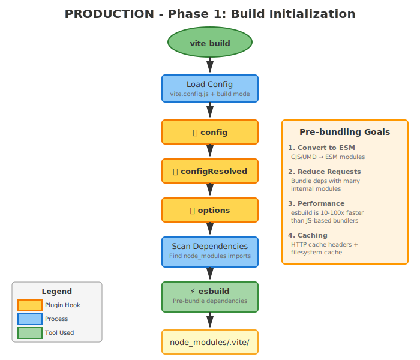
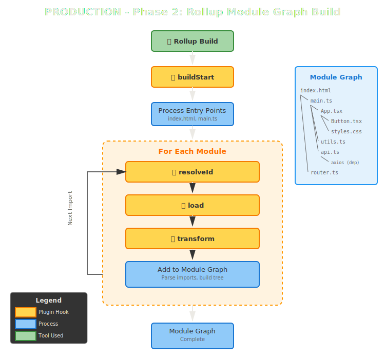

## What is vite?

Vite is a fast, unified web build tool.

It aims to provide a smooth development experience through:

- Instant server start
- Fast hot-module reloading
- Handling TypeScript, JSX and CSS out of the box
- A rich ecosystem of plugins

For production it:

- source maps
- handles tree shaking, code-splitting
- minification and bundling
- assets versioning

## How vite works?

Under the hood vite uses a couple of popular existing tools:

- esbuild
- rollup
- terser

> **NOTE**: there is an ongoing effort from the vite team to
> reimplement the tools used internally in rust. See [oxc](https://oxc.rs/)

## During development

## Production builds

<class-note>

We'll explore how each of the vite stages works in more practical details soon!

</class-note>
