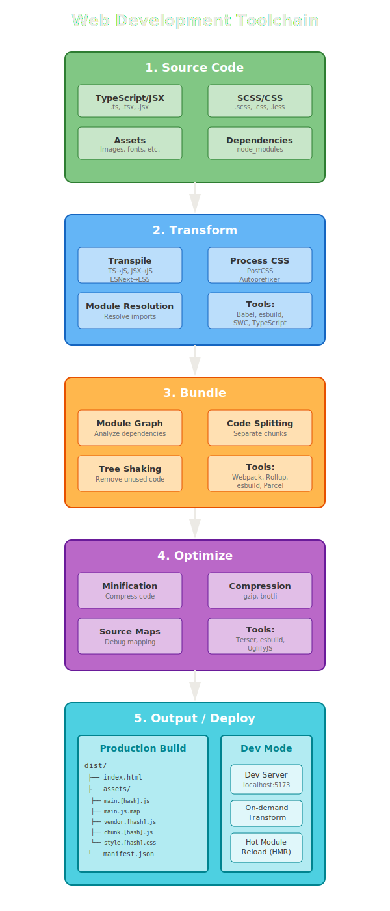

## Why do we need a toolchain?

Throughout the years the web development cycle has
become more and more complex.

We've had to go around limitations of the underlying platforms
(minification, bundling).

We've had to implement tools to help us transition between JS versions
(babel).

We've introduced tools to make our lives easier and our code better
(linters, formatters).

## A short overview of the web build chain

### Transform

Write the code how you want (TypeScript, JSX, SCSS), focus on productivity without worrying about browser support.

### Bundle

Combine hundreds of tiny files into optimized chunks, remove dead code, split for better caching.

### Optimize

Minify and compress for smallest possible file sizes (70-80% reduction), add source maps for debugging

### Output

Two modes: Production (optimized for performance) and Development (optimized for speed and debugging)
